# GitBall

Turn your GitHub contribution graph into a self‑playing DX‑Ball animation.

[](https://www.npmjs.com/package/gitball)
[](https://nodejs.org/)
[](https://opensource.org/licenses/MIT)
[](https://github.com/features/actions)

</img>

```html
<picture>
  <source media="(prefers-color-scheme: dark)" srcset="gitball-dark.svg">
  
</picture>
```
*(Place this `<picture>` snippet in your README, commit the generated SVGs, and watch it come alive!)*


## GitHub Action (Recommended)

Add this workflow to **your own repository** at `.github/workflows/gitball.yml` to get a fresh animation every 2 hours.

```yaml
name: Generate GitBall Animation

on:
  schedule:
    - cron: '0 */2 * * *'   # Runs every 2 hours
  workflow_dispatch:      # Allows manual trigger

jobs:
  generate:
    runs-on: ubuntu-latest
    steps:
      - uses: actions/checkout@v4
      
      # Generate Light version (gitball.svg)
      - uses: Sayad-Uddin-Tahsin/gitball@v1
        with:
          username: ${{ github.repository_owner }}

      # Generate Dark version (gitball-dark.svg)
      - uses: Sayad-Uddin-Tahsin/gitball@v1
        with:
          username: ${{ github.repository_owner }}
          theme: dark
          score: true

      # Commit the SVGs back to your repo
      - name: Commit and push
        run: |
          git config user.name "github-actions[bot]"
          git config user.email "github-actions[bot]@users.noreply.github.com"
          git add gitball*.svg
          git diff --staged --quiet || git commit -m "chore: update GitBall animations [skip ci]"
          git push
```

## Customize It
Add any of these options to the with: section of your workflow to tweak the gameplay.

| Option | Description | Default |
| :--- | :--- | :--- |
| `username` | GitHub username | `${{ github.repository_owner }}` |
| `speed` | Ball speed (pixels/second) | `450` |
| `max-miss` | Misses before the AI forces a hit | `3` |
| `theme` | `light` or `dark` | `light` |
| `score` | Show a live score counter | `false` |

```yaml
- uses: Sayad-Uddin-Tahsin/gitball@v1
  with:
    username: ${{ github.repository_owner }}
    speed: 600
    max-miss: 2
    theme: dark
    score: true
```

## Run Locally (CLI)
Prefer to test it on your machine? Install the CLI globally or run it instantly with npx.

Set your GitHub Token (only needed for local GraphQL API access):

```bash
export GITHUB_TOKEN=your_personal_access_token_here
```

Run it:

```bash
npx gitball --username torvalds --theme dark --score
```
Or if you cloned the repository:

```bash
node index.js --username torvalds --theme light
```

⭐ Star this repo if you think your GitHub grid looks a bit better.
