# GHBall

Turn your GitHub contribution graph into a self‑playing DX‑Ball animation.

[](https://nodejs.org/)
[](https://opensource.org/licenses/Apache-2.0)
[](https://github.com/marketplace/actions/ghball)


```html
  
```
*(Place this `<picture>` snippet in your README, commit the generated SVGs, and watch it come alive!)*


## GitHub Action (Recommended)

Add this workflow to **your own repository** at `.github/workflows/ghball.yml` to get a fresh animation every 2 hours.

```yaml
name: Generate GHBall Animation

on:
  schedule:
    - cron: '0 */2 * * *'
  workflow_dispatch:
  push:
    branches:
      - main

permissions:
  contents: write

jobs:
  generate:
    runs-on: ubuntu-latest
    steps:
      # Generate GHBall animation
      - uses: Sayad-Uddin-Tahsin/GHBall@latest
        with:
          username: ${{ github.repository_owner }}
```

## Customize It
Add any of these options to the with: section of your workflow to tweak the gameplay.

| Option | Description | Default |
| :--- | :--- | :--- |
| `username` | GitHub username | `${{ github.repository_owner }}` |
| `speed` | Ball speed (pixels/second) | `450` |
| `max-miss` | Misses before the AI forces a hit | `3` |
| `theme` | `light` or `dark` | `light` |
| `score` | Show a live score counter | `false` |

```yaml
- uses: Sayad-Uddin-Tahsin/ghball@latest
  with:
    username: ${{ github.repository_owner }}
    speed: 600
    max-miss: 2
    theme: dark
    score: true
```

## Run Locally (CLI)
Prefer to test it on your machine? Clone the repository and run it!

Set your GitHub Token (only needed for GraphQL API access):

```bash
export GITHUB_TOKEN=your_personal_access_token_here
```

After cloning the repository:

```bash
node generator.js --username torvalds --theme light
```

⭐ Star this repo if you think your GitHub grid looks a bit better.
